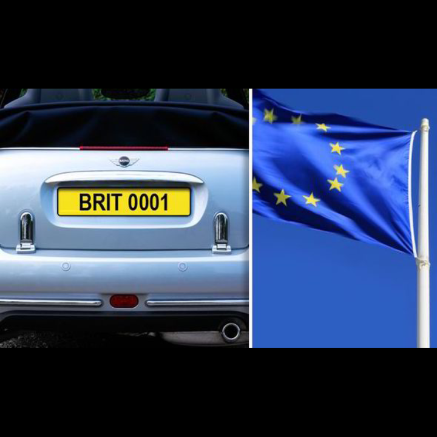

# LicensePlateDetectorAndRecognizer

## A Simple License plate detector:

Using Yolov7 for plate detection and an CNN-LSTM based NeuralNetwork to recognize plate number.

To use, download YOLO trained model from [here](https://drive.google.com/drive/folders/1iR-jNp7ecDzuhAoCx5Q5shGf6tScQpiT?usp=sharing) and add it in ObjectDetector -> YOLOv7 -> yolov7
and download OCR weights from [here](https://drive.google.com/drive/folders/1iR-jNp7ecDzuhAoCx5Q5shGf6tScQpiT?usp=sharing) and add to Assets. "DONT FORGET TO CHANGE CONFIGs"

Although this model is not a perfect one but it is a good excesice for both object detection and OCR.

## EXAMPLE

prediction: "BRIT0001"

## References

[deepayan](https://deepayan137.github.io/blog/markdown/2020/08/29/building-ocr.html)

[Yolov7](https://github.com/WongKinYiu/yolov7)
